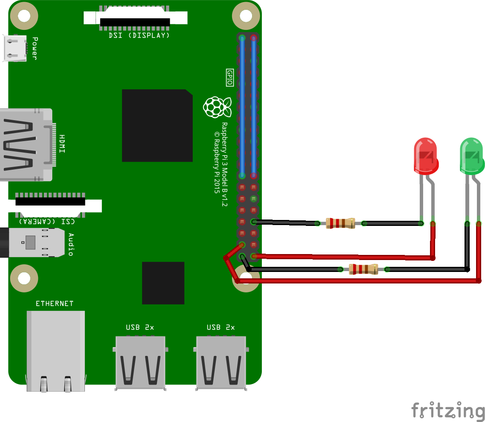

# qlabs-qpay

## Introduction

Welcome to the qlabs qpay repository.

qpay is a simple, fast and complete payment solution that uses IoT devices with network capability and a RFID/NFC scanner as payment terminals.

## Cloning the repo

You can clone the repo with the following command:

```bash
git clone https://github.com/ilionx/qlabs-qpay.git
```

Please make sure git is installed, you can download git commandline tools [here](https://git-scm.com/downloads).

## Set up and run the qpay payment solution

1. Configure and run the qpay backend
    1.1. Creating the database
    1.2. Configure and run the Portal
    1.3. Configure and run the API
2. Setting up a Raspberry pi as payment terminal

## Required hardware

**Everything here is tested with the hardware listed below, you should be able to make this work with most devices like OrangePi/RockPi/Odroid. If you use a different RFID/NFC-scanner please reffer to the guide/how-to for that specific reader as it might be different from the Explore-nfc-ww board.**

* [Raspberry pi](https://www.raspberrypi.org/products/raspberry-pi-3-model-b-plus/)

* [Explore-nfc-ww](https://www.nxp.com/products/identification-and-security/nfc/nfc-reader-ics/explore-nfc-exclusive-from-element14:PNEV512R)

* Any led lights should work.

## Required software

* [Visual Studio](https://visualstudio.microsoft.com/downloads/)
* [Microsoft SQL Server](https://go.microsoft.com/fwlink/?linkid=853017)

-----------

### 1. Configure and run the qpay backend

#### 1.1. Creating the database

#### 1.2. Configure and run the portal

#### 1.3. Configure and run the API

-----------

### 2. Setting up the Raspberry pi as payment terminal

Before we begin with the installation please make sure you have wired the Explore-nfc-ww and led lights to the Raspberry pi as shown below.


*The NFC reader will use most GPIO pins (blue lines)*

#### Required files and settings

* A Raspberry running [raspbian](https://www.raspberrypi.org/downloads/raspbian/)(light)
* [NXP Explore-nfc-ww library](https://www.nxp.com/products/:NFC-READER-LIBRARY?tab=In-Depth_Tab)

*Note: You have to transfer files over to the Raspberry pi, you can use SFTP for this or a service like [transfer.sh](https://transfer.sh/) in combination with the wget command.*

You should enter the raspberry pi configuration and enable the SPI interface.

```bash
sudo raspi-config
```

Select Interfacing Options
Select SPI

Make sure you have the latest updates

```bash
sudo apt-get update        # Fetches the list of available updates
sudo apt-get upgrade       # Strictly upgrades the current packages
sudo apt-get dist-upgrade  # Installs updates (new ones)
```

#### Installation

Since we use python3, make sure python3 is installed on your pi, if you don't use the light Raspbian distro you might have some packages already.

```bash
sudo apt-get install build-essential cmake python3-dev python3-pip
```

Now that we have the required packages we can install the library provided by NXP with the following command:

```bash
sudo dpkg -i NFC-Reader-Library-4.010-2.deb
```

After the library has been installed we can install [nxppy](https://github.com/svvitale/nxppy/releases), a fantastic wrapper for the Explore-nfc-ww nfc module by [svvitale](https://github.com/svvitale).

```bash
pip3 install nxppy
```

If you use the light raspbian image you should install rpi.gpio aswell.

```bash
pip3 install rpi.gpio
```

##### Go time !

Now that you have everything installed you should be able to run the card reader script by executing the following command:

```bash
python3 cardReaderScript.py
```

If everything is installed correctly you should see 'No card detected' as output. If you hold a NFC card on/next to the scanner it should be scanned and posted to the API !

**You have to make sure the url in the python script is pointing towards the address you are hosting your API !!!**

TODO
diagram gpio pinout
